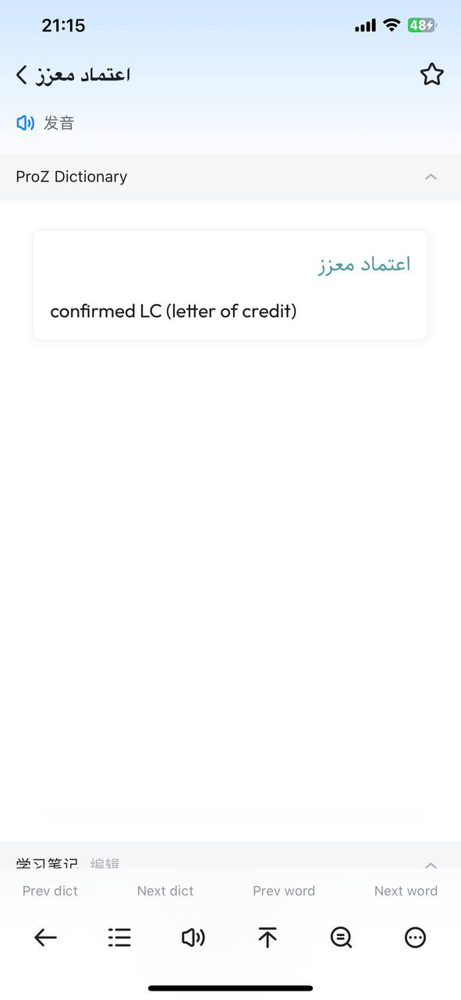

# ProZ Dictionary

**ProZ Dictionary**: English to Arabic &amp; Arabic to English

## Installation

Download and install the required and recommended software / apps for using `MDict dictionary format (.mdx / .mdd)` dictionary data.

- ### Linux

  [**Download GoldenDict-NG (Free)**](https://github.com/xiaoyifang/goldendict-ng/releases)

- ### Windows

  [**Download MDict (Free)**](https://www.mdict.cn/download/MDictPC2.7z)

  [**Download GoldenDict-NG (Free)**](https://github.com/xiaoyifang/goldendict-ng/releases) (Recommended)

- ### MacOS

  [**Download Eudic (Recommended [Free or Paid]**](https://apps.apple.com/us/app/%E6%AC%A7%E8%B7%AF%E8%8B%B1%E8%AF%AD%E8%AF%8D%E5%85%B8-eudic-%E5%A2%9E%E5%BC%BA%E7%89%88/id393670998)

  [**Download GoldenDict-NG (Free)**](https://github.com/xiaoyifang/goldendict-ng/releases)

- ### iOS (iPhone / iPad)

  [**Download Eudic (Recommended [Free or Paid])**](https://apps.apple.com/us/app/%E6%AC%A7%E8%B7%AF%E8%8B%B1%E8%AF%AD%E8%AF%8D%E5%85%B8-eudic-%E6%B1%89%E8%8B%B1%E8%8B%B1%E6%B1%89%E4%BA%92%E8%AF%91%E5%B7%A5%E5%85%B7/id367278030?platform=iphone)

  [**Download Mdict (Paid Version)**](https://itunes.apple.com/cn/app/mdict/id389083586?mt=8)

  [**Download Mdict (Free Version)**](https://itunes.apple.com/cn/app/mdict-free/id894362875)

- ### Android

  [**Downalod DictTango (Recommended [Free])**](https://cloud.freemdict.com/index.php/s/g5nxGwGf6jxgJgQ)

  [**Downalod Eudic (Recommended [Free])**](https://play.google.com/store/apps/details?id=com.qianyan.eudic&hl=en&gl=US)

  [**Downalod Mdict (Free)**](https://play.google.com/store/apps/details?id=cn.mdict)

## Dictionary Files

Each dictionary might have one, two or more files which should include a **MDX**, a **MDD** (_might not included_), a **CSS** and finally an **icon** for the dictionary.

Note:

- **.MDX**, **.MDD** and the **icon (.png, .jpg, etc.)** should have the **same name** and locate in same directory.

- **CSS file SHOULD NOT be renamed**

[Download MDX](./proz.mdx)

Download MDD (Not included)

[Download CSS](./style.css)

[Download Dictionary Icon](./proz.png)

## Used Fonts

[Outfit Font](https://fonts.google.com/specimen/Outfit)

[Sahel Font](https://github.com/rastikerdar/sahel-font/)

## Screenshots

## Usage Instructions

### How to transfer dictionary files into your device?

#### Mobile users:

**iOS (iPhone / iPad )** users can use “`File sharing`” function of **iTunes** to transfer files into devices.

**Android** users should put dictionary files into `/mnt/sdcard/mdict/doc` directory, or assign the path in “`Preference->extra dictionary path`”.

#### **Windows & MacOS Users:**

**MDict (ONLY Windows)** users need to follow below rules:

1. Unzip the package.
2. Open `MDict.exe`
3. On top menu select `Library/Library Manager`
4. Select `Import Library` and browse to the downloaded folder.
5. Click `OK`.

**GoldenDict-NG** users (all platforms) need to follow below rules:

1. Unzip the package.
2. Open `GlodenDict application`
3. On top menu select `Edit/Dictionaries`
4. On `Sources` tab, click `Add` button and browse to the downloaded folder and click `Select Folder` and _tick the checkbox_ beside the downloaded folder location.
5. click on `Apply`, then `OK`.

## Contact me

I hope you like this dictionary. Feel free to reach out if you have questions or if you want to contribute in any way:

- **[Twitter](http://www.twitter.com/0xdolan)**
- **E-mail: [0xdolan@gmail.com](mailto:0xdolan@gmail.com)**

## License

**ProZ Dictionary** is available under the GNU General Public License v3.0 license. See the LICENSE file for more info.
